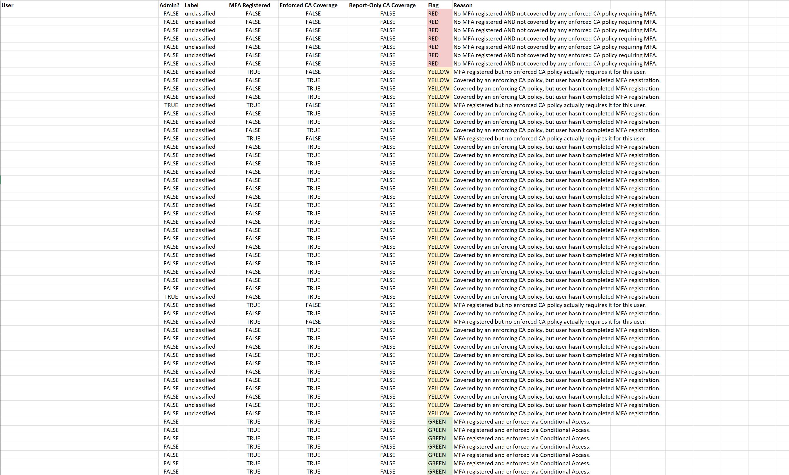
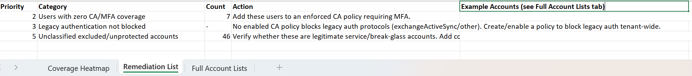

# MFA & Conditional Access Coverage Report

Pulls MFA registration status and Conditional Access policy coverage from
Microsoft Graph API, cross-references them, and produces a per-user
Red/Yellow/Green heatmap plus a prioritized remediation list.

## Setup

1. **Register an Azure AD App** (Entra admin center → App registrations → New registration)
   - Add **Application permissions** (not delegated): `Reports.Read.All`, `AuditLog.Read.All`, `Policy.Read.All`, `Directory.Read.All`
     - Note: Microsoft's docs list `Reports.Read.All` as sufficient for the MFA
       registration report, but in practice the API also requires `AuditLog.Read.All`
       to be granted — without it you'll get a 403 with the error code
       `Authentication_MSGraphPermissionMissing`.
   - Have a Global Admin/Privileged Role Admin grant admin consent for all four permissions
   - Create a client secret under Certificates & secrets

2. **Clone this repo and configure secrets locally**
   ```bash
   cp .env.example .env
   # edit .env with your real tenant ID, client ID, client secret
   ```
   `.env` is gitignored — it will never be committed.

3. **(Optional) Label your break-glass and service accounts**
   This step isn't required — the script runs fully without it. Only do this
   if you want to narrow down the "unclassified" list to just genuinely
   unknown accounts, instead of manually checking every excluded account
   yourself in the report.
   ```bash
   cp known_accounts.json.example known_accounts.json
   # edit known_accounts.json with real UPNs of known break-glass/service accounts
   ```
   `known_accounts.json` is also gitignored since it names real accounts.
   Without this file, the script still runs — it just labels those accounts
   as "unclassified" instead of "break_glass"/"service_account", and flags
   them in the remediation list as "verify manually."

4. **Install dependencies and run**
   ```bash
   pip install -r requirements.txt
   python audit.py
   ```

5. Output lands in `output/mfa_ca_coverage_report_<timestamp>.xlsx` (also gitignored,
   since it contains real tenant user data).

## What it checks

- **MFA registration** — via `reports/authenticationMethods/userRegistrationDetails`
- **CA policy coverage** — whether each user falls under an *enabled* policy
  requiring MFA, vs. only a report-only policy, vs. no policy at all
- **Legacy auth** — whether any enabled policy actually blocks legacy auth
  client types (`exchangeActiveSync`, `other`)
- **Labeling** — cross-references every non-GREEN (RED/YELLOW) user against
  your labeled break-glass/service accounts; anything not labeled shows
  up as "unclassified — verify"

## Understanding the report output

The generated `.xlsx` has three tabs:




- **Coverage Heatmap** — one row per user, color-coded RED/YELLOW/GREEN/INFO,
  sorted worst-to-best
- **Remediation List** — one row per risk category, ranked by priority, with
  up to 5 example accounts per category
- **Full Account Lists** — every account in every category, in full, with no
  truncation (use this if a category's account list is longer than the 5
  examples shown on the Remediation List tab)

### Remediation priority meanings

Priority numbers run from 1 (most urgent) to 5 (least urgent). A priority
only appears in the report if at least one account actually falls into that
category — if a category is empty, it's simply omitted rather than shown as
a zero-count row. So it's normal and expected to see priorities skip
numbers (e.g. only 2, 3, and 5 appearing, with 1 and 4 absent).

| Priority | Category | Meaning |
|---|---|---|
| 1 | Privileged accounts with no protection | Admin accounts with no MFA registered AND no enforced CA policy covering them — highest risk |
| 2 | Users with zero CA/MFA coverage | Non-admin accounts with no MFA registered AND no enforced CA policy covering them |
| 3 | Legacy authentication not blocked | No enabled CA policy blocks legacy auth protocols tenant-wide |
| 4 | Policies in report-only mode | Accounts only covered by a CA policy that's in test/report-only mode, not actually enforcing |
| 5 | Unclassified non-GREEN accounts | Any RED or YELLOW account not labeled as a known break-glass/service account in `known_accounts.json` — needs manual review. Overlaps with priorities 1, 2, and 4, since it isn't filtered by exclusion status |

## Known limitation

CA policy scoping in this script only resolves **direct user includes/excludes**
(`includeUsers`/`excludeUsers`). Policies scoped by **group** membership
(`includeGroups`/`excludeGroups`) aren't expanded — that requires the
`GroupMember.Read.All` permission and an extra membership-resolution pass,
which was left out to keep the initial permission ask minimal. If your CA
policies are primarily group-scoped, coverage numbers here will undercount
protection. Flagging this as a documented next step rather than a silent gap.

## Why secrets are handled this way

- `.env` holds the app registration credentials — never committed, loaded via `python-dotenv`
- `known_accounts.json` names real accounts in your tenant — never committed
- `output/` holds real user data in the generated reports — never committed
- Only the `.example` versions of the above are tracked in git, so anyone
  cloning this repo gets the structure without any real tenant data

Author: Travis Farmer | Computer Science Major @ Georgia State University | IT Intern @ Axion BioSystems